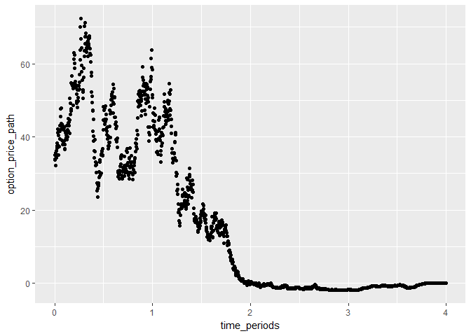

-   [StockPriceSimulator](#stockpricesimulator)
    -   [Introduction](#introduction)
    -   [Functions provided by the
        package](#functions-provided-by-the-package)
        -   [Key functions](#key-functions)
        -   [Optionals or peripherals
            functions](#optionals-or-peripherals-functions)
    -   [Description of the functions as they was created and
        defined](#description-of-the-functions-as-they-was-created-and-defined)
        -   [sstock()](#sstock)
        -   [delta()](#delta)
        -   [theta()](#theta)
        -   [gamma()](#gamma)
    -   [Test Black-Scholes-Merton
        function](#test-black-scholes-merton-function)

StockPriceSimulator
===================

Introduction
------------

This package provide a way to simulate a fully random stock ticker based
on theory provided by \_\_“Stochastic Calculus For Finance ii”,
Shreve“\_\_

Functions provided by the package
---------------------------------

### Key functions

-   Stock price generator for a single instance: [sstock()](sstock)
-   Stock price generator for a single instance, using the Ito’s formula
    approximation [sstock\_ito()](sstock_ito)
-   Position taken in hedging strategy: [delta()](delta)
-   First derivative of option pricing function with respect to time:
    [theta()](theta)
-   Second derivative of option pricing function with respect to stock
    price: [gamma()](gamma)

### Optionals or peripherals functions

-   Multiplier used several time: d

Description of the functions as they was created and defined
------------------------------------------------------------

### sstock()

#### Summary

It returns a data.frame containing the following variables:

-   time\_periods
-   stock\_price\_path

#### Arguments

<table style="width:17%;">
<colgroup>
<col style="width: 5%" />
<col style="width: 5%" />
<col style="width: 5%" />
</colgroup>
<thead>
<tr class="header">
<th>Arguments</th>
<th>Default</th>
<th>Description</th>
</tr>
</thead>
<tbody>
<tr class="odd">
<td>time_to_maturity</td>
<td>4</td>
<td>Final time up to the Stock Price Path goes</td>
</tr>
<tr class="even">
<td>seed</td>
<td>1</td>
<td>It fixes initial value of the pseudo random number generation in order to get reproducible experiments.</td>
</tr>
<tr class="odd">
<td>scale</td>
<td>100</td>
<td>Define the partition of the time period.</td>
</tr>
<tr class="even">
<td>sigma</td>
<td>1</td>
<td></td>
</tr>
</tbody>
</table>

#### Example of Usage

    library(StockPriceSimulator)

    ## 
    ## Attaching package: 'StockPriceSimulator'

    ## The following object is masked from 'package:base':
    ## 
    ##     gamma

    stock_tick <- sstock()

 \#\#\#
sstock()

#### Summary

It returns a data.frame containing the following variables:

-   time\_periods
-   stock\_price\_path

The computed path is based on approximation given by the Itô’s formula.

#### Arguments

<table style="width:17%;">
<colgroup>
<col style="width: 5%" />
<col style="width: 5%" />
<col style="width: 5%" />
</colgroup>
<thead>
<tr class="header">
<th>Arguments</th>
<th>Default</th>
<th>Description</th>
</tr>
</thead>
<tbody>
<tr class="odd">
<td>time_to_maturity</td>
<td>4</td>
<td>Final time up to the Stock Price Path goes</td>
</tr>
<tr class="even">
<td>seed</td>
<td>1</td>
<td>It fixes initial value of the pseudo random number generation in order to get reproducible experiments.</td>
</tr>
<tr class="odd">
<td>scale</td>
<td>100</td>
<td>Define the partition of the time period.</td>
</tr>
<tr class="even">
<td>sigma</td>
<td>1</td>
<td>standard deviation of the stock</td>
</tr>
<tr class="odd">
<td>alpha</td>
<td>0</td>
<td>Mean trend</td>
</tr>
</tbody>
</table>

#### Example of Usage

    library(StockPriceSimulator)
    ## Call the path generating function from equation:
    stock_tick <- sstock(scale = 1000)
    ## Call the path generating function from Itôs approximation
    stock_tick_ito <- sstock_ito(scale = 1000)

### delta()

Delta return the position one should take in order to hedge a short
position in a call.

### theta()

### gamma()

Test Black-Scholes-Merton function
----------------------------------

    # Create a stoch price motion from 0 to 4(Year) with a daily step
    S <- sstock(initial_stock_price = 50,
                time_to_maturity = 4,
                scale = 360)
    # According to the previous sampled path, the option price is computed
    # With option in the money
    C <- BSM(stock_path = S)

